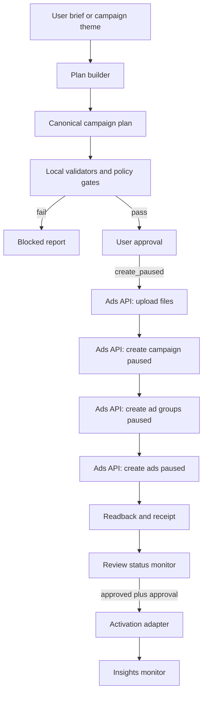

# OpenAI Ads Skill Architecture

Last refreshed: 2026-06-15. Official sources checked: OpenAI Ads developer docs, Ads Manager Help Center, Ads policies, and the Ads OpenAPI spec.

## Architecture Decision

Build the skill as an API-first, gated ad creation operator. The primary write path is the OpenAI Ads Advertiser API. The Ads Manager web UI is a secondary adapter for onboarding, account setup, API key issuance, UI-only beta fields, and visual confirmation.

Do not treat "create an ad" as the same operation as "start spending." The system must separate planning, validation, paused creation, activation, and monitoring.

## Official Product Model

OpenAI Ads currently exposes:

- Advertiser API for campaigns, ad groups, ads, files, ad account, and insights.
- `GET /ad_account` to verify the API key and account context.
- `POST /upload` to upload a remote or local image and receive `file_id`.
- `POST /campaigns`, `POST /ad_groups`, and `POST /ads` for creation.
- Activation, pause, and archive endpoints for campaign and ad group state transitions.
- Ad review states: `in_review`, `approved`, `rejected`.
- Measurement through JavaScript Pixel and Conversions API.
- Guided UI creation and bulk upload as Ads Manager Beta workflows.

## System Layers

### 1. Skill Entry Layer

`SKILL.md` is the short operating entry. It decides which reference files to load and forces mode selection before action. It should stay concise.

### 2. Campaign Planning Layer

Input is a structured business brief, not just a theme:

- advertiser account and brand identity
- product/service eligibility
- landing page URL
- objective: clicks or views
- audience/intent hypotheses
- countries or geo locations
- budget and bidding constraints
- creative assets or image generation requirements
- approval source and owner

Output is a canonical campaign plan. The plan is local and immutable once approved; execution creates a separate receipt.

### 3. Quality And Policy Gate Layer

Gate before any write:

- account readiness
- product category eligibility
- landing page reachability and consistency
- OpenAI crawler compatibility
- title/body length and clarity
- image availability, dimensions, and relevance
- budget floor and bid sanity
- targeting scope
- explicit user approval

Failures block writes. Warnings can proceed only when the user explicitly accepts the residual risk.

### 4. Execution Adapter Layer

Use two adapters behind one interface:

- `AdsApiAdapter`: normal path for create, update, pause, activate, archive, upload, readback, and insights.
- `AdsUiAdapter`: fallback path for onboarding screens, API key provisioning, billing/profile setup checks, and beta-only fields.

The API adapter owns remote writes. The UI adapter must not submit verification, billing, campaign review, or activation without a fresh user confirmation.

### 5. State And Receipt Layer

Persist two artifact types:

- `plan`: canonical local intent before execution.
- `receipt`: remote IDs, response bodies, timestamps, review status, and activation state after execution.

Never infer success from local counters. Only API response/readback or visible UI confirmation counts as remote evidence.

### 6. Monitoring Layer

Monitoring reads:

- ad account identity
- campaign/ad group/ad status
- ad review status
- insights by scope and date granularity
- non-serving reasons when available through UI or API response

Monitoring must not mutate. Optimization suggestions should return a new plan rather than silently editing live entities.

## Data Flow



## Module Layout

Recommended future implementation layout:

```text
openai-ads-skill/
├── SKILL.md
├── agents/openai.yaml
├── references/
│   ├── architecture.md
│   ├── contracts.md
│   └── gates.md
├── scripts/
│   ├── validate-plan.mjs
│   ├── check-account.mjs
│   ├── render-payloads.mjs
│   ├── execute-create-paused.mjs
│   ├── activate-entities.mjs
│   └── monitor-insights.mjs
└── assets/
    └── campaign-plan.schema.json
```

`validate-plan.mjs` and `check-account.mjs` are implemented. Write-path scripts are planned and must keep the same gated execution model.

## Runtime Responsibilities

- `validate-plan.mjs`: fail-fast local schema, policy, landing page, image, and budget checks.
- `check-account.mjs`: read-only authenticated `GET /ad_account` smoke test with redacted output.
- `render-payloads.mjs`: convert the canonical plan into API JSON payloads.
- `execute-create-paused.mjs`: perform upload, campaign, ad group, and ad creation with idempotency receipts.
- `activate-entities.mjs`: activate only approved, existing entities with explicit user confirmation.
- `monitor-insights.mjs`: read review status and performance metrics without mutation.

## Security Model

- Use `OPENAI_ADS_API_KEY`; never store the key in plan or receipt artifacts.
- Treat each API key as scoped to one ad account unless the user has explicit multi-account setup.
- Print only redacted auth context.
- Log request IDs, entity IDs, and non-sensitive payload summaries.
- Never automate card entry, identity verification, or business verification without user handoff.

## Failure Modes

- Missing account setup, verification, billing, or logo: block creation/activation and route to UI onboarding.
- Policy risk: block write until the user changes product, copy, image, or landing page.
- Landing page unreachable or blocks OpenAI user agents: block ad creation.
- Image upload fails: keep plan intact, record failed asset, allow resume.
- Partial API creation: stop, read back created entities, write receipt, and require explicit decision before retry.
- Review rejected: do not auto-edit live entities; generate a remediation plan.

## Implementation Phases

1. Architecture and contracts: complete this skill skeleton and reference files.
2. Offline validator: implemented with `validate-plan.mjs`.
3. API dry run/readback: implemented for `GET /ad_account` with `check-account.mjs`; expand to OpenAPI field validation later.
4. Paused create path: upload files and create paused campaign/ad groups/ads with receipts.
5. Activation path: activate approved entities only after explicit confirmation.
6. Monitoring and optimization: read insights and propose new plans.
7. UI fallback: add Playwright/browser flows only for onboarding and beta-only gaps.

## Acceptance Criteria

- A user can provide a brief and receive a complete campaign plan.
- The plan can be validated locally without network writes.
- Failed gates block writes with specific reasons.
- Paused create produces remote entity IDs and a receipt.
- Activation requires a separate command and approval.
- Monitoring can distinguish local validation, API readback, UI observation, and assumptions.
